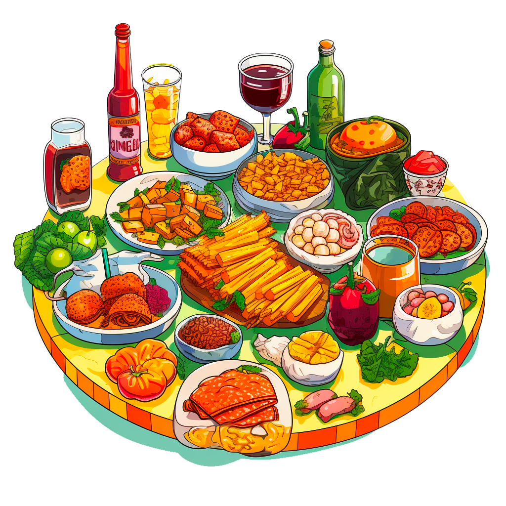

## React Query Project - Event App

React - The Complete Guide 2024 (incl. React Router & Redux)
- Foodies app using Next.js to manage Routing

Requirements:
- Create 3 Routes: /meals, /meals/share, and /community
- Create a dynamic route: /meals/{some slug}

Static/Dynamic Routing Complete